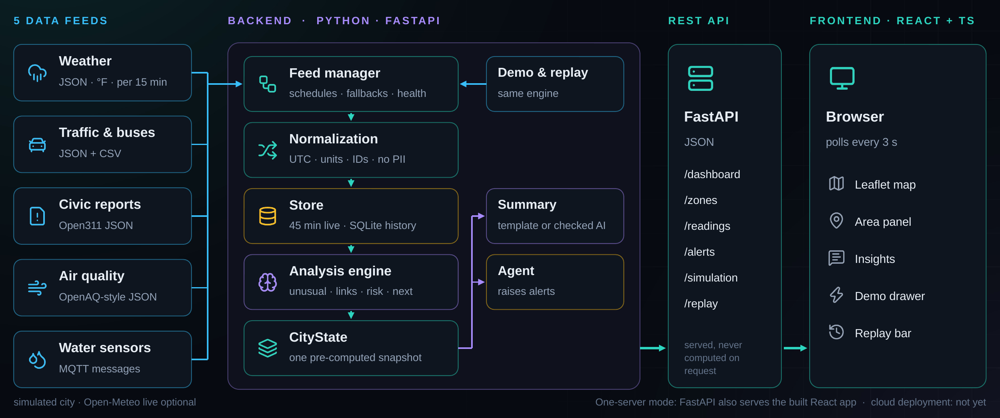
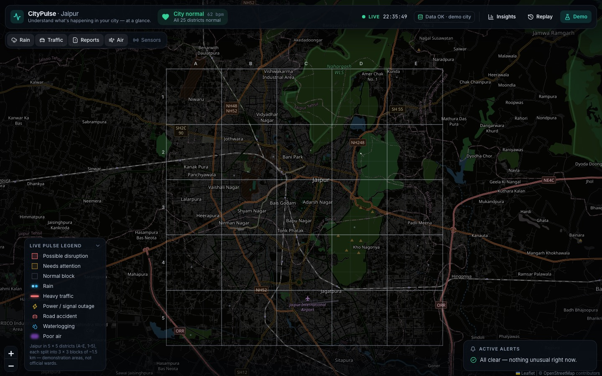
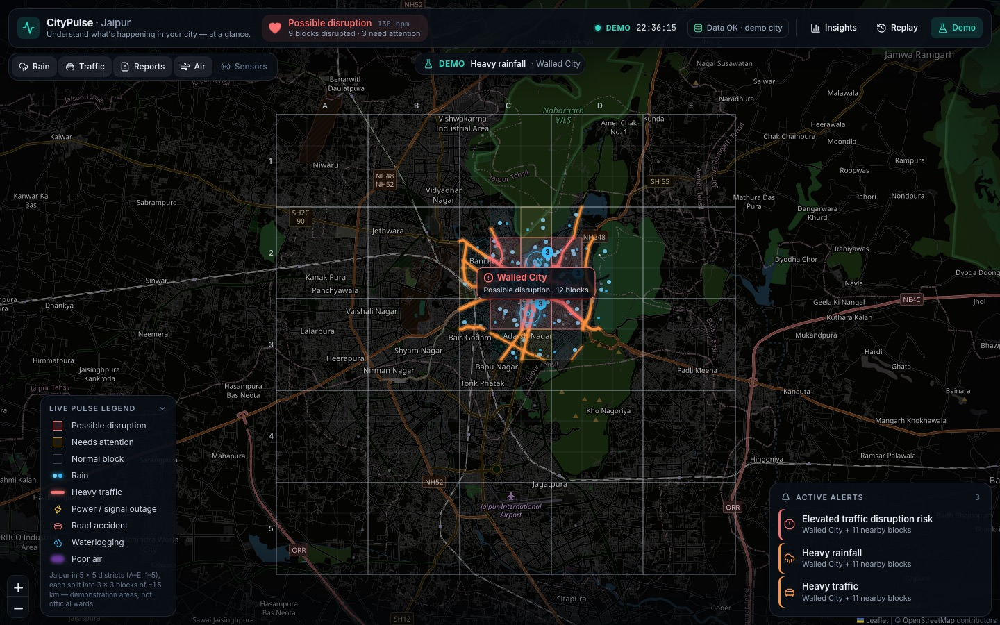
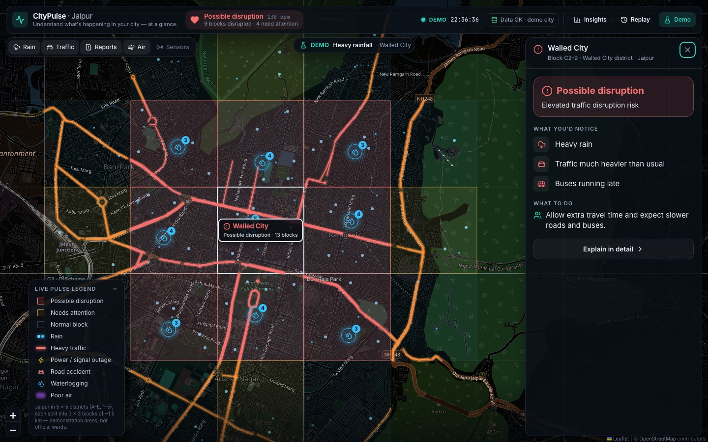
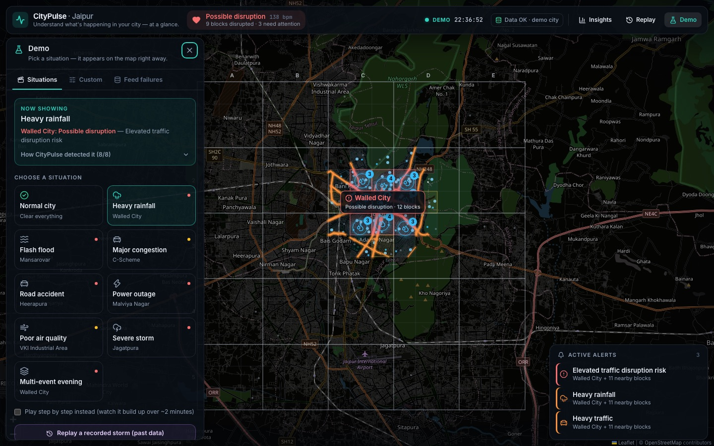
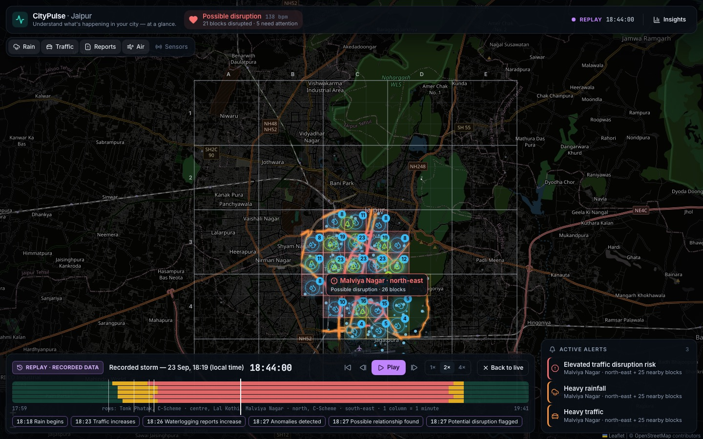

# CityPulse

**Understand what's happening in your city — at a glance.**

CityPulse fuses disconnected civic feeds — weather, traffic and buses, 311-style reports, air
quality and street sensors — into one live, map-first "pulse" that a resident can read in about
ten seconds. It flags what is unusual, surfaces *possible* relationships between signals, and
explains them in plain language, without ever claiming one thing caused another.

> Built for **AmiHacks — Track B: "CityPulse: The Live Civic Health Dashboard"**.

## Hackathon deliverables

| Deliverable | Where |
|---|---|
| GitHub repository | <https://github.com/Faaiz-16/CityPulse> |
| Source code | [`backend/`](backend) (Python · FastAPI) and [`frontend/`](frontend) (React · TypeScript) |
| Architecture diagram | [Below](#architecture) · [`docs/architecture.png`](docs/architecture.png) · details in [ARCHITECTURE.md](docs/ARCHITECTURE.md) |
| Deployment | No public deployment yet. It runs locally in two commands, or as one server ([SETUP.md § 5](docs/SETUP.md#5-one-server-mode-for-judging-or-deployment)) |
| README documentation | This file, plus the [documentation](#documentation) in `docs/` |
| Team contribution details | [Team](#team) |
| Presentation (PPT / PDF) | 10 slides: problem, solution, architecture, features, demo screenshots, future scope ([PRESENTATION.md](docs/PRESENTATION.md)) |
| Demo | [DEMO.md](docs/DEMO.md): the 7-minute presentation + live demo slot |

---

## The problem

Civic information already exists, but it is scattered across feeds that disagree about format,
timing, units and identifiers. Residents find out about a flooded underpass after they are
stuck in it; city staff spot patterns only after someone escalates a complaint. Dashboards that
exist are built for analysts, not for the public.

The hard part isn't putting data on a map — it's **fusing** mismatched feeds into something
trustworthy, finding genuine links rather than coincidences, and **explaining them honestly**.

## Who it's for

- **Primary:** residents of a neighbourhood or district.
- **Secondary:** city operations staff, local journalists, emergency responders, small-business
  owners.

## What CityPulse does

| Step | What happens |
|---|---|
| **Ingest** | 5 feeds in 5 different raw formats (JSON, CSV, Open311, MQTT-style messages) |
| **Normalize** | One common data model: UTC timestamps, standard units, area IDs, per-record validation, personal data stripped |
| **Analyse** | Time-of-day baselines → anomaly detection → rolling-window correlation → possible-impact insight → area status |
| **Show** | A map of Jaipur in 5 × 5 districts, each split into 3 × 3 blocks (~1.5 km); unusual blocks show **Needs attention / Possible disruption** as colour + icon + word |
| **Explain** | "What's happening · Why it may matter · Possible connection" — rule-based, optionally AI-assisted and fact-checked |
| **Watch** | A monitoring agent raises and resolves alerts, keeping *observed facts*, *possible links* and *"not a confirmed cause"* separate |
| **Survive failures** | Any feed can fail, lag or send garbage; the rest keeps working and the UI says exactly what is missing |

## Architecture



```
5 civic feeds ─► feed manager (fallbacks, health) ─► normalization ─► common data model
   ─► rolling store ─► analysis engine (baselines · anomalies · correlation · risk · status)
   ─► CityState ─┬─► map + dashboard (React / Leaflet)
                 ├─► plain-language summary (templates + optional grounded LLM)
                 └─► monitoring agent (alerts)
```

Backend: Python · FastAPI · Pydantic · SQLAlchemy · SQLite.
Frontend: React · TypeScript · Vite · Tailwind CSS · Leaflet · Recharts.
Full details: [docs/ARCHITECTURE.md](docs/ARCHITECTURE.md).

## Key features

- **Jaipur in districts and blocks.** 5 × 5 districts (A–E, 1–5, named after localities — the
  Walled City is C2), each split into 3 × 3 blocks of ~1.5 km (`C2-9` = block 9 of C2): 225 blocks,
  each with its own sensors, baselines and status. Events are local: a storm lights up a
  **hotspot** of neighbouring blocks, a crash just one.
- **Smooth map.** Canvas rendering, no blur behind panels, and layers that only redraw when they
  change — 60 fps while zooming.
- **Map-first, 10-second read.** The default screen is the map, a slim header and a handful of
  alerts. Normal blocks are just faint grid lines; unusual blocks get a soft amber or red tint and
  each hotspot gets one short label. Everything else is one click away.
- **Visual language.** Glowing rain cells, congestion drawn on Jaipur's **real main roads**
  (OpenStreetMap), clustered incident
  icons (⚡ outages, 🚗 accidents, 💧 waterlogging) that appear only when that report type is
  unusual, a purple haze for poor air, optional IoT sensor points.
- **City pulse.** A heart in the header beats at the city's pulse: colour = worst area, speed =
  how much is unusual.
- **Area panel in two levels.** Click an area or alert: a 10-second answer anyone can read (status,
  "What you'd notice", "What to do"). **Explain in detail** adds what's happening, the measured
  evidence and the possible relationship (never a cause); "Show the data behind this" has metrics
  vs normal, "Why these flags?", a 15-minute chart and the agent's reasoning.
- **Honest correlation.** Only logically related signals, same area, same rolling window,
  timing that fits. Strength scored and shown. Weak evidence is labelled *insufficient*.
- **Early warnings.** "Traffic may slow in Walled City (C2-9)" fires when rain is heavy and traffic is
  climbing — *before* it crosses its threshold.
- **What may happen next.** From what is happening now, CityPulse shows the likely knock-on
  impacts here and in neighbouring blocks — e.g. heavy rain → possible flash flooding and power
  cuts nearby — each with a low / medium / high chance, a rough time frame and what it is based
  on. Calm blocks at risk get a dashed violet outline on the map (the "Outlook" layer).
- **Demo drawer.** Eight realistic scenario presets (heavy rain, flash flood, congestion,
  accident, power outage, poor air, severe storm, multi-event) that unfold over time with
  pause and 1×/2×/4×; a live storyline ticks each beat only when the analysis detects it.
  Custom sliders and feed-failure injection too.
- **Historical replay.** Scrub through a recorded storm minute by minute; the same engine and
  agent detect it on past data, with key moments you can jump to. Clearly labelled as recorded.
- **Feed health.** LIVE · SIMULATED · FALLBACK · DELAYED · STALE · UNAVAILABLE in one header chip,
  never hidden and never shown as a raw error.

## Official expected capabilities → where they are

| AmiHacks requirement | CityPulse |
|---|---|
| Ingest 3+ distinct data types | 5 feeds: weather, traffic/transit, civic reports, air quality, IoT water level |
| Normalize + timestamp into a common model | `backend/app/normalization/` → `CivicReading` / `CivicIncident` |
| Detect anomalies or correlations | `backend/app/analysis/` (anomaly, correlation, risk) |
| Live, glanceable dashboard or map | `frontend/` — map-first UI, 3-second refresh |
| Plain-language summary | `backend/app/ai/` — templates + optional validated LLM |
| *Optional:* threshold alerting | Monitoring agent (`backend/app/agent/`) |
| *Optional:* historical replay | Recorded storm replayed minute by minute through the same engine and agent (`backend/app/simulation/replay.py`) |
| Degrade gracefully | Feed manager fallbacks + "cannot assess" reporting |
| Privacy | Personal fields dropped at ingestion; anonymous reports only |
| Correlation ≠ causation | Fixed hedged wording, causal-language validator, separate "not a confirmed cause" labels |

Full traceability: [docs/REQUIREMENTS_MATRIX.md](docs/REQUIREMENTS_MATRIX.md).

## Innovation layer

| Opportunity (from the brief) | Implementation |
|---|---|
| AI/ML anomaly & time-series correlation | Robust median/MAD baselines, robust z-scores, Poisson significance test for report spikes, Pearson co-movement with lead/lag check |
| NLP summaries | Claude API with structured output; numbers and causal wording checked before display |
| Agentic AI | Monitoring agent with a visible reasoning trace and alert hysteresis |
| Creative pulse visualisation | Heartbeat strip, heat-map timeline, narrative ticker |
| Geospatial / IoT | Simulated traffic sensors, rain gauges, air monitors and water-level sensors on the map, feeding the same pipeline |

## Screenshots

**Normal city — the 10-second read**


**Heavy rainfall over the Walled City — a 5-area hotspot, rain cells, congestion on real roads, grouped alerts**


**Area panel — the 10-second answer, with "Explain in detail" for the evidence**


**Demo drawer — a scenario unfolding, beats ticked only when the analysis detects them**


**Historical replay — yesterday's recorded storm, same engine, labelled not live**


Deep links for demos: `/?zone=C2-9` opens a block; `/?replay=1&frame=40` opens the replay at a
recorded minute.

## Installation

Prerequisites: Python 3.11+, Node.js 20.19+ or 22.12+.

### Backend

```bash
cd backend
python3 -m venv .venv
source .venv/bin/activate
pip install -r requirements.txt
uvicorn app.main:app --reload --port 8000
```

### Frontend

```bash
cd frontend
npm install
npm run dev
```

Open <http://localhost:5173>. Full guide and troubleshooting: [docs/SETUP.md](docs/SETUP.md).

### One-server mode

After `npm run build` in `frontend/`, the backend also serves the UI: run only
`uvicorn app.main:app --port 8000` and open <http://localhost:8000>.

### Database

SQLite is created automatically at `backend/data/citypulse.db`, seeded with 3 days of synthetic
history on first run. To use PostgreSQL, set `CITYPULSE_DATABASE_URL` (see SETUP).

### Environment variables

Copy `.env.example` to `backend/.env`. Everything is optional:

| Variable | Default | Purpose |
|---|---|---|
| `CITYPULSE_LIVE_APIS` | `false` | Use real Open-Meteo weather + air quality |
| `ANTHROPIC_API_KEY` | empty | Enable AI-assisted summaries |
| `CITYPULSE_DATABASE_URL` | SQLite file | Database location |
| `CITYPULSE_ROLLING_WINDOW_MINUTES` | `10` | Correlation window |

## Demo mode

Click **Demo** in the header:

1. **Situations** — one click (e.g. *Heavy rainfall · Walled City*) and it is on the map within
   ~2 seconds: the backend fast-forwards the last two minutes of the real pipeline, then the map
   flies there and opens the area panel. No waiting, no refreshing. *How CityPulse detected it*
   lists each step (rain begins → traffic builds → water rises → reports → possible relationship →
   possible disruption) with the time the analysis actually detected it. Tick **Play step by
   step** to watch it build up live instead, with pause and 1×/2×/4×.
2. **Custom** — sliders for rain, flooding, traffic, accident, power outage and air pollution
   around any area.
3. **Feed failures** — set any feed to Outage, Delayed or Malformed and watch CityPulse degrade
   gracefully.
4. **Replay** (header) — last evening's recorded storm through the same pipeline.

Full script with timings: [docs/DEMO.md](docs/DEMO.md).

## Fallback architecture (short version)

- Live API fails → clearly labelled **FALLBACK** estimate, never shown as live.
- Simulated feed fails → last known values (with age), then **UNAVAILABLE**.
- Silent feed → **DELAYED** → **STALE** → **UNAVAILABLE**.
- Missing data → "not assessed", never zero; relationships that depend on it say so.
- Malformed records → rejected individually; valid records keep flowing.
- Database down → live pulse keeps running from memory; health shows storage degraded.
- AI down → rule-based summary (always generated first).

## API overview

| Method | Endpoint | Purpose |
|---|---|---|
| GET | `/api/health` | Pipeline, storage, feed and AI status |
| GET | `/api/dashboard` | Complete civic state (what the UI polls) |
| GET | `/api/zones`, `/api/zones/{id}` | The 225 blocks (with their district); block detail with series and explanation |
| GET | `/api/map` | Grid edges and Jaipur's main roads (OpenStreetMap) per cell |
| GET | `/api/readings`, `/api/incidents` | Normalized recent data |
| GET | `/api/anomalies`, `/api/correlations`, `/api/risks` | Analysis output |
| GET | `/api/summary`, `/api/alerts`, `/api/agent` | Explanations, alerts, agent trace |
| GET | `/api/sources/status`, `/api/sensors`, `/api/timeline` | Feed health, IoT layer, heat-map |
| GET | `/api/simulation/scenarios`, `/api/simulation/status` | Scenario presets, what's running |
| POST | `/api/simulation/scenario`, `/playback`, `/custom`, `/event`, `/reset`, `/feed-fault` | Demo: presets, pause/speed, custom sliders, events, faults |
| GET | `/api/replay`, `/api/replay/frames/{i}`, `/api/replay/frames/{i}/zones/{id}` | Historical replay |

Interactive docs at <http://127.0.0.1:8000/docs> while the backend runs.

## Project structure

```
backend/
  app/
    api/            HTTP endpoints
    data_sources/   synthetic city + raw feed formats + live API clients
    normalization/  timestamps, units, per-format normalizers
    analysis/       baselines, anomalies, correlation, risk, engine
    ai/             fact sheet, templates, LLM client, grounding validator
    agent/          monitoring agent
    simulation/     scenario presets, scenario clock, custom scenarios, history, replay
    services/       pipeline, feed manager, rolling store, persistence
    geo/            Jaipur districts (5 × 5) and blocks (3 × 3 each), names, main roads (OSM)
  tests/            128 tests (normalization, analysis, forecast, resilience, AI, agent, scenarios, replay, API)
frontend/
  src/
    components/     Header, AlertsCard, map/ (grid, layers, legend), zone/ (area panel), drawers/ (Demo, Insights)
    hooks/ services/ types/ utils/
docs/               guides, API, database, demo, presentation, judge Q&A, screenshots
```

File-by-file explanation: [docs/FILE_GUIDE.md](docs/FILE_GUIDE.md).

## Documentation

| Document | For |
|---|---|
| [SETUP.md](docs/SETUP.md) | Installing, running, testing, troubleshooting |
| [TEAM_GUIDE.md](docs/TEAM_GUIDE.md) | Beginner-friendly explanation of every part, and how to change it |
| [ARCHITECTURE.md](docs/ARCHITECTURE.md) | Pipeline, algorithms, thresholds, design decisions |
| [API.md](docs/API.md) | Every endpoint with real examples |
| [DATABASE.md](docs/DATABASE.md) | Tables, indexes, seeding, migrations |
| [FILE_GUIDE.md](docs/FILE_GUIDE.md) | What each file does |
| [REQUIREMENTS_MATRIX.md](docs/REQUIREMENTS_MATRIX.md) | Brief requirement → feature → code → test → demo |
| [DEMO.md](docs/DEMO.md) | The 7-minute judging slot: timed run sheet, live demo steps and recovery plan |
| [PRESENTATION.md](docs/PRESENTATION.md) · [PITCH_SCRIPT.md](docs/PITCH_SCRIPT.md) | The 10-slide deck and what to say |
| [JUDGE_QA.md](docs/JUDGE_QA.md) | 36 likely judge questions with answers |
| [FINAL_CHECKLIST.md](docs/FINAL_CHECKLIST.md) | The brief's validation checklist, with evidence for every item |

## Limitations

- Districts and blocks are a demonstration grid over Jaipur, not official wards; the city's data is simulated
  (labelled SIMULATED) unless live weather/air-quality APIs are switched on.
- Data is synthetic unless a feed reports LIVE; the model is realistic but not calibrated on a
  real city.
- Relationship rules are hand-written; CityPulse can show signals overlap, never why.
- Replay covers one recorded event; 3D view not implemented.

## Future scope

- Connect real city feeds (311 portals, GTFS-Realtime transit, traffic APIs) through the same
  normalizers.
- Replay of any time range and multi-day pattern mining.
- Learned relationship discovery (e.g. Granger tests) reviewed by humans before being shown.
- Notifications for residents who subscribe to an area.
- Optional 3D view of buildings and sensor density.

## Team

| Name | Role | Contributions |
|---|---|---|
| [Member 1] | [e.g. Backend & data pipeline] | [e.g. feed simulation, normalization, common data model] |
| [Member 2] | [e.g. Analysis & AI] | [e.g. baselines, anomalies, correlation, forecast, summaries, agent] |
| [Member 3] | [e.g. Frontend & map] | [e.g. React UI, Leaflet map, drawers, replay] |
| [Member 4] | [e.g. Testing, docs & pitch] | [e.g. tests, documentation, presentation, demo] |

## License

No license chosen yet — add one (for example MIT) before publishing the repository.
